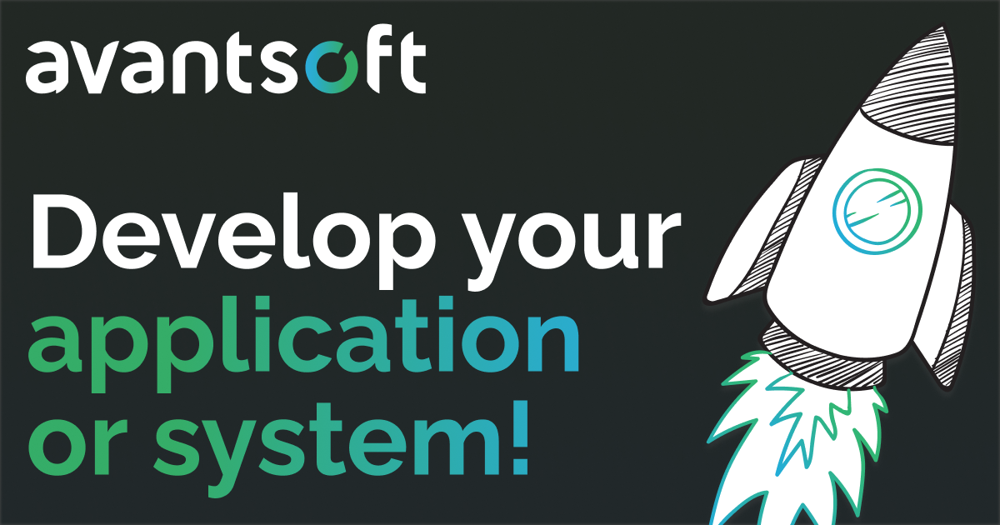

# Avantsoftchain

**Avantsoftchain** is an innovative organization focused on building scalable, decentralized blockchain and web-based solutions.

## What We Do

- **Blockchain Development**: Smart contracts, decentralized applications (dApps).
- **Web Development**: Modern, responsive web solutions.
- **NFT Solutions**: Integration and creation of non-fungible tokens (NFTs).
- **Consultancy**: Blockchain and web development consultancy for businesses.

## Technologies We Use

- **Blockchain**: Ethereum, Binance Smart Chain, Solana.
- **Web Development**: React, Node.js, and more.
- **NFT Standards**: ERC-721, ERC-1155.

## Get in Touch

- **Website**: [avantsoftchain.com](https://avantsoft.com.br/)
- **Email**: cesarhr@avantsoftchain.com

---
*Building the future, one block at a time.*
